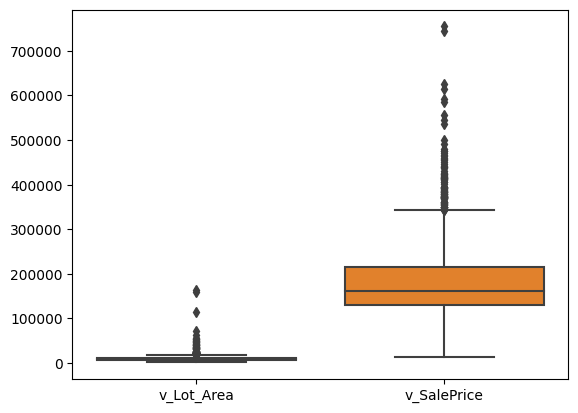

## Part 1: EDA

_Insert cells as needed below to write a short EDA/data section that summarizes the data for someone who has never opened it before._ 
- Answer essential questions about the dataset (observation units, time period, sample size, many of the questions above) 
- Note any issues you have with the data (variable X has problem Y that needs to get addressed before using it in regressions or a prediction model because Z)
- Present any visual results you think are interesting or important


```python
import pandas as pd
from statsmodels.formula.api import ols as sm_ols
import numpy as np
import seaborn as sns
from statsmodels.iolib.summary2 import summary_col # nicer tables
import matplotlib.pyplot as plt


Sale_price=pd.read_csv("C:\\Users\\10795\\Documents\\FIN377\\asgn-06-chengxiwu\\input_data2\\housing_train.csv")
Sale_price.v_Garage_Area


```


    0        866.0
    1        905.0
    2       1220.0
    3        400.0
    4        774.0
             ...  
    1936     501.0
    1937       0.0
    1938     520.0
    1939       0.0
    1940     400.0
    Name: v_Garage_Area, Length: 1941, dtype: float64


```python
#Unit of observation: 1941. Time span include years and monthly sales.
# Outliers 
sns.boxplot(data=Sale_price[[ 'v_Lot_Area', 'v_SalePrice']])
plt.show()


```


    

    


```python
missing_values = Sale_price.isnull().sum()
pd.DataFrame(missing_values)
```


<div>
<style scoped>
    .dataframe tbody tr th:only-of-type {
        vertical-align: middle;
    }

    .dataframe tbody tr th {
        vertical-align: top;
    }

    .dataframe thead th {
        text-align: right;
    }
</style>
<table border="1" class="dataframe">
  <thead>
    <tr style="text-align: right;">
      <th></th>
      <th>0</th>
    </tr>
  </thead>
  <tbody>
    <tr>
      <th>parcel</th>
      <td>0</td>
    </tr>
    <tr>
      <th>v_MS_SubClass</th>
      <td>0</td>
    </tr>
    <tr>
      <th>v_MS_Zoning</th>
      <td>0</td>
    </tr>
    <tr>
      <th>v_Lot_Frontage</th>
      <td>321</td>
    </tr>
    <tr>
      <th>v_Lot_Area</th>
      <td>0</td>
    </tr>
    <tr>
      <th>...</th>
      <td>...</td>
    </tr>
    <tr>
      <th>v_Mo_Sold</th>
      <td>0</td>
    </tr>
    <tr>
      <th>v_Yr_Sold</th>
      <td>0</td>
    </tr>
    <tr>
      <th>v_Sale_Type</th>
      <td>0</td>
    </tr>
    <tr>
      <th>v_Sale_Condition</th>
      <td>0</td>
    </tr>
    <tr>
      <th>v_SalePrice</th>
      <td>0</td>
    </tr>
  </tbody>
</table>
<p>81 rows × 1 columns</p>
</div>


```python
#EDA Analysis
from eda import insufficient_but_starting_eda


vars_to_desc = ['parcel', 'v_MS_SubClass', 'v_MS_Zoning', 'v_Lot_Frontage',
       'v_Lot_Area', 'v_Street', 'v_Alley', 'v_Lot_Shape', 'v_Land_Contour',
       'v_Utilities', 'v_Lot_Config', 'v_Land_Slope', 'v_Neighborhood',
       'v_Condition_1', 'v_Condition_2', 'v_Bldg_Type', 'v_House_Style',
       'v_Overall_Qual', 'v_Overall_Cond', 'v_Year_Built', 'v_Year_Remod/Add',
       'v_Roof_Style', 'v_Roof_Matl', 'v_Exterior_1st', 'v_Exterior_2nd',
       'v_Mas_Vnr_Type', 'v_Mas_Vnr_Area', 'v_Exter_Qual', 'v_Exter_Cond',
       'v_Foundation', 'v_Bsmt_Qual', 'v_Bsmt_Cond', 'v_Bsmt_Exposure',
       'v_BsmtFin_Type_1', 'v_BsmtFin_SF_1', 'v_BsmtFin_Type_2',
       'v_BsmtFin_SF_2', 'v_Bsmt_Unf_SF', 'v_Total_Bsmt_SF', 'v_Heating',
       'v_Heating_QC', 'v_Central_Air', 'v_Electrical', 'v_1st_Flr_SF',
       'v_2nd_Flr_SF', 'v_Low_Qual_Fin_SF', 'v_Gr_Liv_Area',
       'v_Bsmt_Full_Bath', 'v_Bsmt_Half_Bath', 'v_Full_Bath', 'v_Half_Bath',
       'v_Bedroom_AbvGr', 'v_Kitchen_AbvGr', 'v_Kitchen_Qual',
       'v_TotRms_AbvGrd', 'v_Functional', 'v_Fireplaces', 'v_Fireplace_Qu',
       'v_Garage_Type', 'v_Garage_Yr_Blt', 'v_Garage_Finish', 'v_Garage_Cars',
       'v_Garage_Area', 'v_Garage_Qual', 'v_Garage_Cond', 'v_Paved_Drive',
       'v_Wood_Deck_SF', 'v_Open_Porch_SF', 'v_Enclosed_Porch', 'v_3Ssn_Porch',
       'v_Screen_Porch', 'v_Pool_Area', 'v_Pool_QC', 'v_Fence',
       'v_Misc_Feature', 'v_Misc_Val', 'v_Mo_Sold', 'v_Yr_Sold', 'v_Sale_Type',
       'v_Sale_Condition', 'v_SalePrice']    # underlying vars are good to look at

insufficient_but_starting_eda(Sale_price[vars_to_desc],['v_SalePrice'])

```

               parcel  v_MS_SubClass v_MS_Zoning  v_Lot_Frontage  v_Lot_Area  \
    0  1056_528110080             20          RL           107.0       13891   
    1  1055_528108150             20          RL            98.0       12704   
    2  1053_528104050             20          RL           114.0       14803   
    3  2213_909275160             20          RL           126.0       13108   
    4  1051_528102030             20          RL            96.0       12444   
    
      v_Street v_Alley v_Lot_Shape v_Land_Contour v_Utilities  ... v_Pool_Area  \
    0     Pave     NaN         Reg            Lvl      AllPub  ...           0   
    1     Pave     NaN         Reg            Lvl      AllPub  ...           0   
    2     Pave     NaN         Reg            Lvl      AllPub  ...           0   
    3     Pave     NaN         IR2            HLS      AllPub  ...           0   
    4     Pave     NaN         Reg            Lvl      AllPub  ...           0   
    
      v_Pool_QC v_Fence v_Misc_Feature v_Misc_Val v_Mo_Sold v_Yr_Sold  \
    0       NaN     NaN            NaN          0         1      2008   
    1       NaN     NaN            NaN          0         1      2008   
    2       NaN     NaN            NaN          0         6      2008   
    3       NaN     NaN            NaN          0         6      2007   
    4       NaN     NaN            NaN          0        11      2008   
    
       v_Sale_Type  v_Sale_Condition  v_SalePrice  
    0          New           Partial       372402  
    1          New           Partial       317500  
    2          New           Partial       385000  
    3          WD             Normal       153500  
    4          New           Partial       394617  
    
    [5 rows x 81 columns] 
    ---
                  parcel  v_MS_SubClass v_MS_Zoning  v_Lot_Frontage  v_Lot_Area  \
    1936  2524_534125210            190          RL            79.0       13110   
    1937  2846_909131125            190          RH             NaN        7082   
    1938  2605_535382020            190          RL            60.0       10800   
    1939  1516_909101180            190          RL            55.0        5687   
    1940  1387_905200100            190          RL            60.0       12900   
    
         v_Street v_Alley v_Lot_Shape v_Land_Contour v_Utilities  ... v_Pool_Area  \
    1936     Pave     NaN         IR1            Lvl      AllPub  ...           0   
    1937     Pave     NaN         Reg            Lvl      AllPub  ...           0   
    1938     Pave     NaN         Reg            Lvl      AllPub  ...           0   
    1939     Pave    Grvl         Reg            Bnk      AllPub  ...           0   
    1940     Pave     NaN         Reg            Lvl      AllPub  ...           0   
    
         v_Pool_QC v_Fence v_Misc_Feature v_Misc_Val v_Mo_Sold v_Yr_Sold  \
    1936       NaN   MnPrv            NaN          0         7      2006   
    1937       NaN     NaN            NaN          0         7      2006   
    1938       NaN     NaN            NaN          0         5      2006   
    1939       NaN     NaN            NaN          0         3      2008   
    1940       NaN     NaN            NaN          0         1      2008   
    
          v_Sale_Type  v_Sale_Condition  v_SalePrice  
    1936          WD             Normal       146500  
    1937          WD             Normal       160000  
    1938        ConLD            Normal       160000  
    1939          WD             Normal       135900  
    1940          WD             Alloca        95541  
    
    [5 rows x 81 columns] 
    ---
    Index(['parcel', 'v_MS_SubClass', 'v_MS_Zoning', 'v_Lot_Frontage',
           'v_Lot_Area', 'v_Street', 'v_Alley', 'v_Lot_Shape', 'v_Land_Contour',
           'v_Utilities', 'v_Lot_Config', 'v_Land_Slope', 'v_Neighborhood',
           'v_Condition_1', 'v_Condition_2', 'v_Bldg_Type', 'v_House_Style',
           'v_Overall_Qual', 'v_Overall_Cond', 'v_Year_Built', 'v_Year_Remod/Add',
           'v_Roof_Style', 'v_Roof_Matl', 'v_Exterior_1st', 'v_Exterior_2nd',
           'v_Mas_Vnr_Type', 'v_Mas_Vnr_Area', 'v_Exter_Qual', 'v_Exter_Cond',
           'v_Foundation', 'v_Bsmt_Qual', 'v_Bsmt_Cond', 'v_Bsmt_Exposure',
           'v_BsmtFin_Type_1', 'v_BsmtFin_SF_1', 'v_BsmtFin_Type_2',
           'v_BsmtFin_SF_2', 'v_Bsmt_Unf_SF', 'v_Total_Bsmt_SF', 'v_Heating',
           'v_Heating_QC', 'v_Central_Air', 'v_Electrical', 'v_1st_Flr_SF',
           'v_2nd_Flr_SF', 'v_Low_Qual_Fin_SF', 'v_Gr_Liv_Area',
           'v_Bsmt_Full_Bath', 'v_Bsmt_Half_Bath', 'v_Full_Bath', 'v_Half_Bath',
           'v_Bedroom_AbvGr', 'v_Kitchen_AbvGr', 'v_Kitchen_Qual',
           'v_TotRms_AbvGrd', 'v_Functional', 'v_Fireplaces', 'v_Fireplace_Qu',
           'v_Garage_Type', 'v_Garage_Yr_Blt', 'v_Garage_Finish', 'v_Garage_Cars',
           'v_Garage_Area', 'v_Garage_Qual', 'v_Garage_Cond', 'v_Paved_Drive',
           'v_Wood_Deck_SF', 'v_Open_Porch_SF', 'v_Enclosed_Porch', 'v_3Ssn_Porch',
           'v_Screen_Porch', 'v_Pool_Area', 'v_Pool_QC', 'v_Fence',
           'v_Misc_Feature', 'v_Misc_Val', 'v_Mo_Sold', 'v_Yr_Sold', 'v_Sale_Type',
           'v_Sale_Condition', 'v_SalePrice'],
          dtype='object') 
    ---
    The shape is:  (1941, 81) 
    ---
    <class 'pandas.core.frame.DataFrame'>
    RangeIndex: 1941 entries, 0 to 1940
    Data columns (total 81 columns):
     #   Column             Non-Null Count  Dtype  
    ---  ------             --------------  -----  
     0   parcel             1941 non-null   object 
     1   v_MS_SubClass      1941 non-null   int64  
     2   v_MS_Zoning        1941 non-null   object 
     3   v_Lot_Frontage     1620 non-null   float64
     4   v_Lot_Area         1941 non-null   int64  
     5   v_Street           1941 non-null   object 
     6   v_Alley            136 non-null    object 
     7   v_Lot_Shape        1941 non-null   object 
     8   v_Land_Contour     1941 non-null   object 
     9   v_Utilities        1941 non-null   object 
     10  v_Lot_Config       1941 non-null   object 
     11  v_Land_Slope       1941 non-null   object 
     12  v_Neighborhood     1941 non-null   object 
     13  v_Condition_1      1941 non-null   object 
     14  v_Condition_2      1941 non-null   object 
     15  v_Bldg_Type        1941 non-null   object 
     16  v_House_Style      1941 non-null   object 
     17  v_Overall_Qual     1941 non-null   int64  
     18  v_Overall_Cond     1941 non-null   int64  
     19  v_Year_Built       1941 non-null   int64  
     20  v_Year_Remod/Add   1941 non-null   int64  
     21  v_Roof_Style       1941 non-null   object 
     22  v_Roof_Matl        1941 non-null   object 
     23  v_Exterior_1st     1941 non-null   object 
     24  v_Exterior_2nd     1941 non-null   object 
     25  v_Mas_Vnr_Type     1923 non-null   object 
     26  v_Mas_Vnr_Area     1923 non-null   float64
     27  v_Exter_Qual       1941 non-null   object 
     28  v_Exter_Cond       1941 non-null   object 
     29  v_Foundation       1941 non-null   object 
     30  v_Bsmt_Qual        1891 non-null   object 
     31  v_Bsmt_Cond        1891 non-null   object 
     32  v_Bsmt_Exposure    1889 non-null   object 
     33  v_BsmtFin_Type_1   1891 non-null   object 
     34  v_BsmtFin_SF_1     1940 non-null   float64
     35  v_BsmtFin_Type_2   1891 non-null   object 
     36  v_BsmtFin_SF_2     1940 non-null   float64
     37  v_Bsmt_Unf_SF      1940 non-null   float64
     38  v_Total_Bsmt_SF    1940 non-null   float64
     39  v_Heating          1941 non-null   object 
     40  v_Heating_QC       1941 non-null   object 
     41  v_Central_Air      1941 non-null   object 
     42  v_Electrical       1940 non-null   object 
     43  v_1st_Flr_SF       1941 non-null   int64  
     44  v_2nd_Flr_SF       1941 non-null   int64  
     45  v_Low_Qual_Fin_SF  1941 non-null   int64  
     46  v_Gr_Liv_Area      1941 non-null   int64  
     47  v_Bsmt_Full_Bath   1939 non-null   float64
     48  v_Bsmt_Half_Bath   1939 non-null   float64
     49  v_Full_Bath        1941 non-null   int64  
     50  v_Half_Bath        1941 non-null   int64  
     51  v_Bedroom_AbvGr    1941 non-null   int64  
     52  v_Kitchen_AbvGr    1941 non-null   int64  
     53  v_Kitchen_Qual     1941 non-null   object 
     54  v_TotRms_AbvGrd    1941 non-null   int64  
     55  v_Functional       1941 non-null   object 
     56  v_Fireplaces       1941 non-null   int64  
     57  v_Fireplace_Qu     1001 non-null   object 
     58  v_Garage_Type      1836 non-null   object 
     59  v_Garage_Yr_Blt    1834 non-null   float64
     60  v_Garage_Finish    1834 non-null   object 
     61  v_Garage_Cars      1940 non-null   float64
     62  v_Garage_Area      1940 non-null   float64
     63  v_Garage_Qual      1834 non-null   object 
     64  v_Garage_Cond      1834 non-null   object 
     65  v_Paved_Drive      1941 non-null   object 
     66  v_Wood_Deck_SF     1941 non-null   int64  
     67  v_Open_Porch_SF    1941 non-null   int64  
     68  v_Enclosed_Porch   1941 non-null   int64  
     69  v_3Ssn_Porch       1941 non-null   int64  
     70  v_Screen_Porch     1941 non-null   int64  
     71  v_Pool_Area        1941 non-null   int64  
     72  v_Pool_QC          13 non-null     object 
     73  v_Fence            365 non-null    object 
     74  v_Misc_Feature     63 non-null     object 
     75  v_Misc_Val         1941 non-null   int64  
     76  v_Mo_Sold          1941 non-null   int64  
     77  v_Yr_Sold          1941 non-null   int64  
     78  v_Sale_Type        1941 non-null   object 
     79  v_Sale_Condition   1941 non-null   object 
     80  v_SalePrice        1941 non-null   int64  
    dtypes: float64(11), int64(26), object(44)
    memory usage: 1.2+ MB
    Info: None 
    ---
           v_MS_SubClass  v_Lot_Frontage     v_Lot_Area  v_Overall_Qual  \
    count    1941.000000     1620.000000    1941.000000     1941.000000   
    mean       58.088614       69.301235   10284.770222        6.113344   
    std        42.946015       23.978101    7832.295527        1.401594   
    min        20.000000       21.000000    1470.000000        1.000000   
    25%        20.000000       58.000000    7420.000000        5.000000   
    50%        50.000000       68.000000    9450.000000        6.000000   
    75%        70.000000       80.000000   11631.000000        7.000000   
    max       190.000000      313.000000  164660.000000       10.000000   
    
           v_Overall_Cond  v_Year_Built  v_Year_Remod/Add  v_Mas_Vnr_Area  \
    count     1941.000000   1941.000000       1941.000000     1923.000000   
    mean         5.568264   1971.321999       1984.073158      104.846074   
    std          1.087465     30.209933         20.837338      184.982611   
    min          1.000000   1872.000000       1950.000000        0.000000   
    25%          5.000000   1953.000000       1965.000000        0.000000   
    50%          5.000000   1973.000000       1993.000000        0.000000   
    75%          6.000000   2001.000000       2004.000000      168.000000   
    max          9.000000   2008.000000       2009.000000     1600.000000   
    
           v_BsmtFin_SF_1  v_BsmtFin_SF_2  ...  v_Wood_Deck_SF  v_Open_Porch_SF  \
    count     1940.000000     1940.000000  ...     1941.000000      1941.000000   
    mean       436.986598       49.247938  ...       92.458011        49.157135   
    std        457.815715      169.555232  ...      127.020523        70.296277   
    min          0.000000        0.000000  ...        0.000000         0.000000   
    25%          0.000000        0.000000  ...        0.000000         0.000000   
    50%        361.500000        0.000000  ...        0.000000        28.000000   
    75%        735.250000        0.000000  ...      168.000000        72.000000   
    max       5644.000000     1474.000000  ...     1424.000000       742.000000   
    
           v_Enclosed_Porch  v_3Ssn_Porch  v_Screen_Porch  v_Pool_Area  \
    count       1941.000000   1941.000000     1941.000000  1941.000000   
    mean          22.947965      2.249871       16.249871     3.386399   
    std           65.249307     22.416832       56.748086    43.695267   
    min            0.000000      0.000000        0.000000     0.000000   
    25%            0.000000      0.000000        0.000000     0.000000   
    50%            0.000000      0.000000        0.000000     0.000000   
    75%            0.000000      0.000000        0.000000     0.000000   
    max         1012.000000    407.000000      576.000000   800.000000   
    
             v_Misc_Val    v_Mo_Sold    v_Yr_Sold    v_SalePrice  
    count   1941.000000  1941.000000  1941.000000    1941.000000  
    mean      52.553838     6.431221  2006.998454  182033.238022  
    std      616.064459     2.745199     0.801736   80407.100395  
    min        0.000000     1.000000  2006.000000   13100.000000  
    25%        0.000000     5.000000  2006.000000  130000.000000  
    50%        0.000000     6.000000  2007.000000  161900.000000  
    75%        0.000000     8.000000  2008.000000  215000.000000  
    max    17000.000000    12.000000  2008.000000  755000.000000  
    
    [8 rows x 37 columns] 
    ---
    v_SalePrice has 820 values and its top 10 most common are:
    140000    26
    135000    23
    145000    21
    130000    21
    155000    18
    120000    16
    170000    15
    250000    14
    160000    14
    127000    14
    Name: v_SalePrice, dtype: int64 
    ---
    

# Continuous variabels:
- v_Lot_Frontage,v_Lot_Area,v_Mas_Vnr_Area,v_BsmtFin_F_ ,v_BsmtFin_SF_2,v_Bsmt_Unf_SF ,v_Bsmt_Unf_SF,v_BsmtFin_SF_2,v_Total_Bsmt_SF ,v_1st_Flr_SF ,v_2nd_Flr_SF,
    v_Low_Qual_Fin_SF,v_Gr_Liv_Area,v_Garage_Area,v_Wood_Deck_SF ,v_Open_Porch_SF ,v_Enclosed_Porch ,v_3Ssn_Porch ,v_Screen_Porch,v_Pool_Are,v_Misc_Val,SalePrice
    

# Discrete variables: 
- v_Year_Built,v_Year_Remod/Add, v_Bsmt_Full_Bath,v_Bsmt_Half_Bath,v_Full_Bath,v_Half_Bath,v_Bedroom,v_Kitchen,v_Tot_Rms_Abv_Grd,v_Fireplaces,v_Garage_Yr_Blt,v_Garage_Cars,
    v_Mo_Sold, v_Yr_Sold
 


```python
#searching for correlation between variables that I think is important
subset=Sale_price[["v_SalePrice","v_Lot_Area","v_Neighborhood",'v_Overall_Qual','v_Mas_Vnr_Area','v_Bedroom_AbvGr','v_Yr_Sold','v_BsmtFin_SF_2','v_Bsmt_Unf_SF' ,'v_Total_Bsmt_SF']]


corr_matrix = subset.corr()

# Plot the heatmap
sns.heatmap(corr_matrix, cmap='coolwarm', annot=True)

# Show the plot
plt.show()
```


    

    


## Part 2: Running Regressions

**Run these regressions on the RAW data, even if you found data issues that you think should be addressed.**

_Insert cells as needed below to run these regressions. Note that $i$ is indexing a given house, and $t$ indexes the year of sale._ 

1. $\text{Sale Price}_{i,t} = \alpha + \beta_1 * \text{v_Lot_Area}$
1. $\text{Sale Price}_{i,t} = \alpha + \beta_1 * log(\text{v_Lot_Area})$
1. $log(\text{Sale Price}_{i,t}) = \alpha + \beta_1 * \text{v_Lot_Area}$
1. $log(\text{Sale Price}_{i,t}) = \alpha + \beta_1 * log(\text{v_Lot_Area})$
1. $log(\text{Sale Price}_{i,t}) = \alpha + \beta_1 * \text{v_Yr_Sold}$
1. $log(\text{Sale Price}_{i,t}) = \alpha + \beta_1 * (\text{v_Yr_Sold==2007})+ \beta_2 * (\text{v_Yr_Sold==2008})$
1. Choose your own adventure: Pick any five variables from the dataset that you think will generate good R2. Use them in a regression of $log(\text{Sale Price}_{i,t})$ 
    - Tip: You can transform/create these five variables however you want, even if it creates extra variables. For example: I'd count Model 6 above as only using one variable: `v_Yr_Sold`.
    - I got an R2 of 0.877 with just "5" variables. How close can you get? I won't be shocked if someone beats that!
    

**Bonus formatting trick:** Instead of reporting all regressions separately, report all seven regressions in a _single_ table using `summary_col`.


```python
Sale_price = (Sale_price
                  # create variables
                  .assign(l_v_Lot_Area = np.log(Sale_price['v_Lot_Area']),
                          l_SalePrice = np.log(Sale_price['v_SalePrice']),
                         
                          Origination_Date = lambda x: pd.to_datetime(x['v_Yr_Sold']),
                          Origination_Year = lambda x: x['Origination_Date'].dt.year,
                          const = 1
                         ))
                 

```


```python
reg1 = sm_ols('v_SalePrice ~ v_Lot_Area ', data=Sale_price).fit()
reg2 = sm_ols('v_SalePrice ~ l_v_Lot_Area ', data=Sale_price).fit()
reg3 = sm_ols('l_SalePrice ~ v_Lot_Area ', data=Sale_price).fit()
reg4 = sm_ols('l_SalePrice ~ l_v_Lot_Area ', data=Sale_price).fit()
reg5 = sm_ols('l_SalePrice ~ v_Yr_Sold ', data=Sale_price).fit()
reg6= sm_ols('l_SalePrice ~ (v_Yr_Sold==2007) + (v_Yr_Sold==2008)', data=Sale_price).fit()
reg7 = sm_ols('l_SalePrice ~ np.log(v_Lot_Area)+v_Neighborhood+v_Overall_Qual +v_Mas_Vnr_Area+v_Total_Bsmt_SF ', data=Sale_price).fit()

info_dict={'R-squared' : lambda x: f"{x.rsquared:.2f}",
           'Adj R-squared' : lambda x: f"{x.rsquared_adj:.2f}",
           'No. observations' : lambda x: f"{int(x.nobs):d}"}
table = summary_col([reg1, reg2, reg3, reg4, reg5, reg6, reg7],
                    model_names=['Model 1', 'Model 2', 'Model 3', 'Model 4', 'Model 5', 'Model 6', 'Model 7'],
                    float_format='%.4f',
                    stars=True,
                    info_dict=info_dict,
                    regressor_order=[ 'Intercept','v_Total_Bsmt_SF','v_Lot_Area','v_Mas_Vnr_Area',
                                  'v_Overall_Qua','v_Yr_Sold','v_Yr_Sold == 2007[T.True]','v_Yr_Sold == 2008[T.True]','v_Neighborhood'])
print(table)
```

    
    =============================================================================================================
                                 Model 1         Model 2      Model 3    Model 4   Model 5   Model 6    Model 7  
    -------------------------------------------------------------------------------------------------------------
    Intercept                 154789.5502*** -327915.8023*** 11.8941*** 9.4051*** 22.2932   12.0229*** 9.6128*** 
                              (2911.5906)    (30221.3471)    (0.0146)   (0.1511)  (22.9368) (0.0161)   (0.0990)  
    v_Total_Bsmt_SF                                                                                    0.0001*** 
                                                                                                       (0.0000)  
    v_Lot_Area                2.6489***                      0.0000***                                           
                              (0.2252)                       (0.0000)                                            
    v_Mas_Vnr_Area                                                                                     0.0001*** 
                                                                                                       (0.0000)  
    v_Yr_Sold                                                                     -0.0051                        
                                                                                  (0.0114)                       
    v_Yr_Sold == 2007[T.True]                                                               0.0256               
                                                                                            (0.0222)             
    v_Yr_Sold == 2008[T.True]                                                               -0.0103              
                                                                                            (0.0228)             
    v_Neighborhood[T.Sawyer]                                                                           -0.2302***
                                                                                                       (0.0462)  
    v_Neighborhood[T.NPkVill]                                                                          -0.1570** 
                                                                                                       (0.0715)  
    v_Neighborhood[T.NWAmes]                                                                           -0.1666***
                                                                                                       (0.0465)  
    v_Neighborhood[T.NoRidge]                                                                          0.0912*   
                                                                                                       (0.0499)  
    v_Neighborhood[T.NridgHt]                                                                          0.0087    
                                                                                                       (0.0455)  
    v_Neighborhood[T.OldTown]                                                                          -0.3119***
                                                                                                       (0.0444)  
    v_Neighborhood[T.SWISU]                                                                            -0.2295***
                                                                                                       (0.0538)  
    v_Neighborhood[T.SawyerW]                                                                          -0.1309***
                                                                                                       (0.0472)  
    v_Neighborhood[T.Somerst]                                                                          -0.0615   
                                                                                                       (0.0439)  
    v_Neighborhood[T.Mitchel]                                                                          -0.2006***
                                                                                                       (0.0474)  
    v_Neighborhood[T.StoneBr]                                                                          0.0136    
                                                                                                       (0.0508)  
    v_Neighborhood[T.Timber]                                                                           -0.0735   
                                                                                                       (0.0493)  
    v_Neighborhood[T.Veenker]                                                                          -0.0905   
                                                                                                       (0.0583)  
    v_Overall_Qual                                                                                     0.1516*** 
                                                                                                       (0.0047)  
    v_Neighborhood[T.NAmes]                                                                            -0.2283***
                                                                                                       (0.0436)  
    v_Neighborhood[T.MeadowV]                                                                          -0.1673***
                                                                                                       (0.0548)  
    v_Neighborhood[T.ClearCr]                                                                          -0.0895   
                                                                                                       (0.0546)  
    v_Neighborhood[T.Landmrk]                                                                          -0.1479   
                                                                                                       (0.1823)  
    l_v_Lot_Area                             56028.1700***              0.2883***                                
                                             (3315.1392)                (0.0166)                                 
    np.log(v_Lot_Area)                                                                                 0.1691*** 
                                                                                                       (0.0109)  
    v_Neighborhood[T.Blueste]                                                                          -0.0964   
                                                                                                       (0.0976)  
    v_Neighborhood[T.BrDale]                                                                           -0.3075***
                                                                                                       (0.0575)  
    v_Neighborhood[T.BrkSide]                                                                          -0.2889***
                                                                                                       (0.0467)  
    v_Neighborhood[T.CollgCr]                                                                          -0.1233***
                                                                                                       (0.0436)  
    v_Neighborhood[T.Crawfor]                                                                          -0.0489   
                                                                                                       (0.0468)  
    v_Neighborhood[T.Edwards]                                                                          -0.2862***
                                                                                                       (0.0452)  
    v_Neighborhood[T.Gilbert]                                                                          -0.1270***
                                                                                                       (0.0458)  
    v_Neighborhood[T.Greens]                                                                           -0.1660*  
                                                                                                       (0.0890)  
    v_Neighborhood[T.GrnHill]                                                                          0.2218*   
                                                                                                       (0.1326)  
    v_Neighborhood[T.IDOTRR]                                                                           -0.4337***
                                                                                                       (0.0475)  
    R-squared                 0.0666         0.1284          0.0646     0.1350    0.0001    0.0014     0.8085    
    R-squared Adj.            0.0661         0.1279          0.0641     0.1345    -0.0004   0.0004     0.8054    
    R-squared                 0.07           0.13            0.06       0.13      0.00      0.00       0.81      
    Adj R-squared             0.07           0.13            0.06       0.13      -0.00     0.00       0.81      
    No. observations          1941           1941            1941       1941      1941      1941       1922      
    =============================================================================================================
    Standard errors in parentheses.
    * p<.1, ** p<.05, ***p<.01
    

## Part 3: Regression interpretation

_Insert cells as needed below to answer these questions. Note that $i$ is indexing a given house, and $t$ indexes the year of sale._ 

1. If you didn't use the `summary_col` trick, list $\beta_1$ for Models 1-6 to make it easier on your graders.
1. Interpret $\beta_1$ in Model 2. 
1. Interpret $\beta_1$ in Model 3. 
    - HINT: You might need to print out more decimal places. Show at least 2 non-zero digits. 
1. Of models 1-4, which do you think best explains the data and why?
1. Interpret $\beta_1$ In Model 5
1. Interpret $\alpha$ in Model 6
1. Interpret $\beta_1$ in Model 6
1. Why is the R2 of Model 6 higher than the R2 of Model 5?
1. What variables did you include in Model 7?
1. What is the R2 of your Model 7?
1. Speculate (not graded): Could you use the specification of Model 6 in a predictive regression? 
1. Speculate (not graded): Could you use the specification of Model 5 in a predictive regression? 


```python
beta1 = reg1.params[1]
beta2 = reg2.params[1]
beta3=reg3.params[1]
beta4=reg4.params[1]
beta5=reg5.params[1]
beta6=reg6.params[1]
beta6_1=reg6.params[2]
beta7=reg7.params[1]
print(f"""Beta:
reg1[1]:{beta1}
reg2[1]:{beta2}
reg3[1]:{beta3}
reg4[1]:{beta4}
reg5[1]:{beta5}
reg6[1]:{beta6}
reg6_1[1]:{beta6_1}
reg7[1]:{beta7}""")
```

    Beta:
    reg1[1]:2.64893500071819
    reg2[1]:56028.16996046534
    reg3[1]:1.3092338465836461e-05
    reg4[1]:0.28826331962292917
    reg5[1]:-0.005114348195819674
    reg6[1]:0.02559031997162553
    reg6_1[1]:-0.010281565074467052
    reg7[1]:-0.09642303448862953
    


```python

print(f""" Reg 2:

beta:       {beta2}

when Lot_Area raise up by 1 %, the Sale Price increased by {beta2/100} units""")
```

     Reg 2:
    
    beta:       56028.16996046534
    
    when Lot_Area raise up by 1 %, the Sale Price increased by 560.2816996046535 units
    


```python

print(f""" Reg 3:

beta:       {beta3}

when Lot_Area raise up by 1 unit, the Sale Price increased by {100*1.3092338465836461e-07}.
""")
```

     Reg 3:
    
    beta:       1.3092338465836461e-05
    
    when Lot_Area raise up by 1 unit, the Sale Price increased by 1.3092338465836463e-05.
    
    


```python

print(f""" Reg 4:

beta:       {beta4}

when Lot_Area raise up by 1%, the Sale Price increased by {beta4}%.
""")
```

     Reg 4:
    
    beta:       0.28826331962292917
    
    when Lot_Area raise up by 1%, the Sale Price increased by 0.28826331962292917%.
    
    


```python
print(f""" Reg 5:

beta:       {beta5}

when sold on year raised up by 1%, the Sale Price decreased by {100*beta5/100}.
""")
```

     Reg 5:
    
    beta:       -0.005114348195819674
    
    when sold on year raised up by 1%, the Sale Price decreased by -0.005114348195819674.
    
    


```python
print(f""" Reg 6:
alpha: {reg6.params[0]}
beta:       {beta6}

In this model alpha means that average value of log(y) is 12.0256 for group 0(x=0).
Beta means that the Sale Price in 2007 is about {100*(beta6/100)} higher on average.

""")
```

     Reg 6:
    alpha: 12.022869210751978
    beta:       0.02559031997162553
    
    In this model alpha means that average value of log(y) is 12.0256 for group 0(x=0).
    Beta means that the Sale Price in 2007 is about 0.02559031997162553 higher on average.
    
    
    

# Question 8-10

- 8 Why is the R2 of Model 6 higher than the R2 of Model 5?
    
  Because the model 6 includes more information about the relationship between sale price and year sold, it is expected to have a higher R-squared value than the model 5. 

- 9 What variables did you include in Model 7?

  np.log(v_Lot_Area),v_Neighborhood,v_Overall_Qual ,v_Mas_Vnr_Area,v_Total_Bsmt_SF

- 10 What is the R2 of your Model 7?

  0.81
